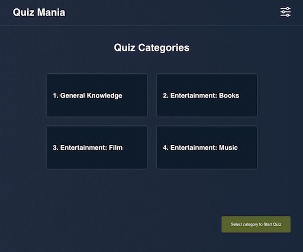

# Quiz Mania - React TS Web App

This app allows users to do quizes pulled from a [Open Trivia Database API](https://opentdb.com/) 

##Screenshots
####Quiz Categories (desktop)

####Menu difficulty levels (mobile)

####Quiz question view (desktop)

####Quiz question view (mobile)

##Tooling: 
* React
* TypeScript
* React Router
* Redux
* ReduxToolkit (with default middleware)
* Axios (for demonstration purposes mainly, [ReduxToolkit](https://redux-toolkit.js.org/rtk-query/api/createApi) offers an even more convenient solution for data fetching along with its default middleware and hooks)
* Styled-components
* Prettier

This project was bootstrapped with [Create React App](https://github.com/facebook/create-react-app).

## Available Scripts

In the project directory, you can run:
### `yarn` 
To install project dependencies
### `yarn start`
To run the app in the development mode.\
Open [http://localhost:3000](http://localhost:3000) to view it in the browser.

The page will reload if you make edits.\
You will also see any lint errors in the console.

